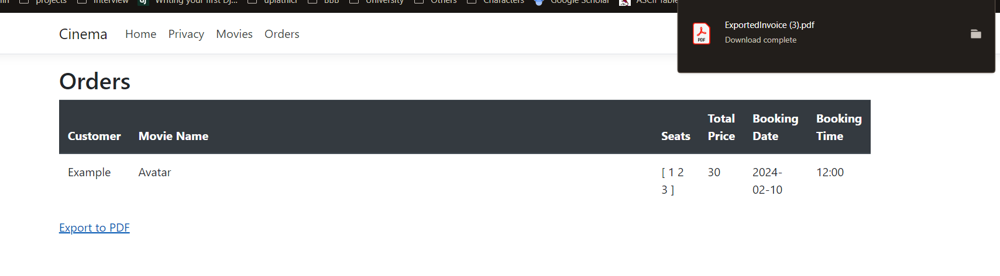

# Cinema_IS_Project - Integrated Systems

### Project Overview
This project implements a cinema booking system where users can book movie tickets along with corresponding seats, dates, and times. It utilizes ASP.NET Core Onion Architecture to maintain a clean and modular codebase.

### Technologies used
- Frontend: Razor syntax
- Backend: ASP.NET Core
- Database: PostgreSQL

### How it works
The booking process involves selecting a movie at a 
specific date and time. Users can book movies at 9:00, 
12:00, 15:00, and 18:00 for today and up to 3 days in the future. 
Edge cases such as preventing bookings for past dates or 
times are handled seamlessly.

Once booked, users can navigate to the 'Orders' tab to view 
all their booked movies. Additionally, they have the option 
to export order details in a '.pdf' format for easy reference.

### Conclusion
The Cinema Integrated Systems project aims to provide a 
seamless and user-friendly experience for booking cinema 
tickets. With its robust architecture and intuitive interface, 
users can easily browse and book movies while administrators 
can efficiently manage bookings and theater operations.

###Image preview of the Web Application

*Figure 1: All movies listed in the 'Movies' tab.*

*Figure 2: Booking a particular movie.*

*Figure 3: Viewing all orders.*

*Figure 4: Viewing all available seats.*

*Figure 5: Exporting orders to '.pdf' format.*

*Figure 6: Viewing the '.pdf' format.*

